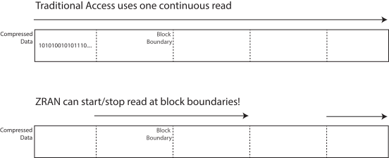

## The Problem
Like most forms of data analysis, remote sensing has traditionally operated in a file-first paradigm. In this setup, data is packaged in discrete files or zip archives and these are downloaded/decompressed to a local environment before you begin analyzing the data. 

However, with the growth in dataset sizes, the move to cloud-based computing, and new tools like [Xarray](https://docs.xarray.dev/en/stable/index.html), the industry is moving towards a dataset-first paradigm. In a dataset-first paradigm we think about grabbing the specific data we want from a global dataset instead of downloading discrete files that contain portions of the dataset. If you want an example of how this is done, go check out the [PANGEO](https://pangeo.io) project! A major advantage of this approach is that you can specify an area-of-interest/time-of-interest, and download only the data you *actually* need - greatly decreasing the amount of data you need to download!

Unfortunately though, the ways in which many older datasets are packaged makes it difficult to provide dataset-first services for them. The [Kerchunk](https://fsspec.github.io/kerchunk/) project is working to overcome these issues, but a major stumbling block we'll need to fix is the limitations on data access that many compression types impose.

Compression is a key way that we can increase download speeds and reduce data storage costs, but many compression types such as the popular [DEFLATE](https://www.rfc-editor.org/rfc/rfc1951) compression used in gzip and zip files **do not support random access reads**. This isn't a problem if you plan to download/decompress the whole data file, but dataset-first access patterns rely on the ability to grab only the data they need from much larger files (i.e., random access reads). Since *SO* much data is stored in either gzip or zip archives, this severely limits our ability to provide dataset-first access to older data.

I've been working on a new project that should make this much easier though!

## Enter ZRAN
I'm not the first person to think about this problem, in fact Mark Adler the creator of the DEFLATE algorithm and the popular Zlib package has already come up with a solution. He developed a utility called ZRAN that can provide pseudo-random reads for DEFLATE-compressed data. It turns out that DEFLATE-compressed data is compressed in discrete 10-100 Kb blocks, and if the Zlib package is provided with the right information, it can start decompressing from any of these block boundaries!



In practice, ZRAN decompresses the data once, then uses information gained while decompressing to create a sidecar index file that contains "bookmarks" into the compressed. You can then use the "bookmarks" contained within the index file to start reading from any block boundary on subsequent reads.

You can find Mark's code in the [examples directory](https://github.com/madler/zlib/tree/master/examples) of the Zlib GitHub repository! However, this utility was only available as a C-utility and could not be easily incorporated into dataset-first access projects (e.g., Xarray and Kerchunk) that are being developed in Python. If you are working exclusively with gzip files though, go give [indexed_gzip](https://github.com/pauldmccarthy/indexed_gzip) a try!

Fixing this data access problem is very important to me, so I decided to take on the task of creating Python bindings for ZRAN using [Cython](https://cython.org). It was my first foray into the intimidating world of pointers and memory management, but I learned a lot and it was worth the effort! I combined the base ZRAN Cython bindings with some additional index manipulation to create what I hope is useful Python library for compressed data extraction. I also created a fair amount of GitHub Actions based CI/CD tooling for the project, which really helps me maintain and publish the package (if you want to hear more about this setup, let me know!).

To use ZRAN Python library, you need to:

1. Create an index for a compressed file
2. Optionally save this index
3. Use this index to access the data on subsequent reads

To create the index:
```python
import zran

with open('compressed.gz', 'rb') as f:
    compressed_file = f.read()
    index = zran.Index.create_index(compressed_file)
```
This `Index` can be written to a file (`index.to_file('index.dflidx')`), or directly passed to `zran.deompress`:
```python
start = 1000
length = 2000
data = zran.decompress(compressed_file, index, start, length)
```

That's it!

## What's Next for ZRAN?

While ZRAN is already a powerful tool for working with compressed data, I believe that there is much more that can be done with it. By combining ZRAN with other projects such as STAC and kerchunk, it may be possible to create a zarr-like interface for archival datasets! This would allow us to work with large datasets as if they were small, local files, without having to worry about the underlying complexity of the data storage.

In the meantime, I'm already using the ZRAN python package in my [Sentinel-1 burst extractor project](https://github.com/forrestfwilliams/zran), which demonstrates its potential to be used in a wide range of applications. If you're interested in trying out ZRAN for yourself, you can install from PyPI today!
